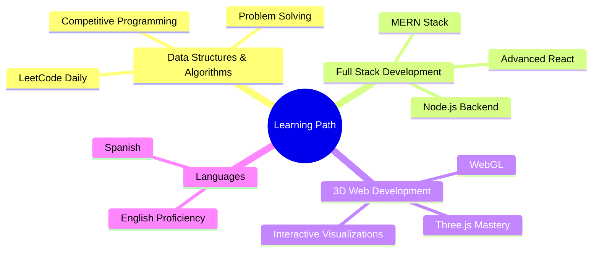

<div align="center">
  
</div>

<p align="center">
  
  
</p>

<p align="center">
  <a href="mailto:arnab.mazumder1108@gmail.com">
    
  </a>
  <a href="https://www.linkedin.com/in/arnab-mazumder-b4a238326">
    
  </a>
  <a href="https://web-resume-h0a5.onrender.com">
    
  </a>
</p>

---

## 👨‍💻 About Me

```yaml
name: Arnab Mazumder
education: B.Tech in Information Science & Engineering (2nd Year)
university: Jain University
location: Bengaluru, India
interests: [Full-Stack Development, 3D Visualization, Campus Innovation, AI Integration]
currently_learning: [DSA, MERN Stack, Advanced JavaScript, Spanish]
philosophy: "Building practical solutions that make everyday life easier"
```

🎯 **Focus**: Creating innovative web applications and interactive systems that solve real-world problems.

---

## 🚀 Featured Projects

<table>
<tr>
<td width="50%" valign="top">

### 🧭 [Jain Campus Navigator](https://github.com/arnab-mazumder/Jain-Campus-Navigator)
**Smart Campus Navigation System**

Interactive campus navigation solution helping students and visitors find their way around Jain University campus with ease.

**🎯 Features:**
- 🗺️ Interactive campus map interface
- 📍 Real-time location tracking
- 🔍 Smart search for buildings & rooms
- 🚶 Optimized route planning
- 📱 Mobile-responsive design

**💻 Tech Stack:**  
`JavaScript` `Leaflet.js` `HTML5` `CSS3`

**📅 Last Updated:** Nov 9, 2025

<a href="https://github.com/arnab-mazumder/Jain-Campus-Navigator">
  
</a>

</td>
<td width="50%" valign="top">

### ✈️ [Aircraft Error Detection](https://github.com/arnab-mazumder/Aircraft-Error-Detection)
**3D Aircraft Fault Visualization System**

Interactive 3D visualization system for real-time aircraft component monitoring featuring a modern glassmorphism UI design.

**⚡ Features:**
- 🎨 Modern glassmorphism interface
- 🔴 Real-time component issue detection
- 💡 Visual fault indicators with animations
- 🔌 Spring Boot backend integration
- 🎮 Interactive 3D aircraft model

**💻 Tech Stack:**  
`Three.js` `CSS3` `JavaScript` `Spring Boot`

**📅 Last Updated:** Jun 24, 2025

<a href="https://github.com/arnab-mazumder/Aircraft-Error-Detection">
  
</a>

</td>
</tr>

<tr>
<td width="50%" valign="top">

### 🛋️ [Furniture Store Website](https://github.com/arnab-mazumder/furniture_store_website)
**E-Commerce Platform for Furniture**

Full-featured e-commerce website for furniture shopping with modern design and seamless user experience.

**🛒 Features:**
- 🏪 Product catalog with categories
- 🔍 Advanced search & filtering
- 🛍️ Shopping cart functionality
- 👤 User authentication system
- 💳 Payment gateway integration ready
- 📱 Responsive design

**💻 Tech Stack:**  
`PHP` `MySQL` `JavaScript` `Bootstrap` `CSS3`

**📅 Last Updated:** Aug 6, 2025

<a href="https://github.com/arnab-mazumder/furniture_store_website">
  
</a>

</td>
<td width="50%" valign="top">

### 📚 More Projects In Development

Currently working on exciting new projects in:

- 🤖 **AI/ML Applications** - Healthcare & Accessibility
- 🗳️ **Civic Tech** - Voting & Democracy Solutions  
- 📦 **Campus Solutions** - Student Life Improvements
- ♿ **Accessibility Tools** - STEM Education for All
- 🌐 **Full-Stack Apps** - Modern Web Solutions

**Stay tuned for updates!**

<a href="https://github.com/arnab-mazumder?tab=repositories">
  
</a>

</td>
</tr>
</table>

---

## 💻 Tech Stack

<div align="center">

### Languages


### Frameworks & Libraries


### Tools & Platforms


### AI & Backend


</div>

---

## 📊 GitHub Statistics

<div align="center">
  
  
</div>

<div align="center">
  
</div>

<div align="center">
  
</div>

---

## 🏆 Achievements & Recognition

<div align="center">

| 🏅 Achievement | 🎯 Event | 📅 Year |
|---|---|---|
| 🥇 **Finalist** | Salesforce Product Jam | 2025 |
| 🏆 **Winner** | Technical Treasure Hunt @ MATRIX | 2025 |
| 🥉 **3rd Place** | CRCE Ideathon | 2025 |
| 🥈 **Runner-Up** | TRIWIZARD CTF (Cybersecurity) | 2025 |

</div>

---

## 🌱 Currently Learning

<div align="center">



</div>

**Current Focus:**
- 🔥 **DSA on LeetCode** - Building strong problem-solving fundamentals
- 🌐 **MERN Stack** - Mastering full-stack development
- 🎮 **Three.js & WebGL** - Creating immersive 3D experiences
- 🌍 **Spanish** - Expanding global communication skills

---

## 🎯 What Drives Me

I'm passionate about building technology that makes a tangible difference in people's lives. Whether it's helping students navigate campus, visualizing complex aircraft systems, or creating accessible e-commerce experiences - I focus on practical solutions that solve real problems.

**My Approach:**
- 🚀 **Innovation First** - Always exploring new technologies and methodologies
- 🤝 **User-Centric** - Building with the end-user's needs at the forefront
- 📚 **Continuous Learning** - Staying updated with the latest in tech
- 🌍 **Social Impact** - Creating solutions that contribute to society

---

## 📫 Let's Connect

<div align="center">

**Open to collaborations in:**  
🚀 Web Development • 🎮 3D Visualizations • 🤖 AI/ML Projects • 🌍 Social Impact Tech

<a href="mailto:arnab.mazumder1108@gmail.com">
  
</a>
<a href="https://www.linkedin.com/in/arnab-mazumder-b4a238326/">
  
</a>
<a href="https://web-resume-h0a5.onrender.com">
  
</a>

</div>

---

<div align="center">
  
</div>

<div align="center">
  
</div>
