  

<h3 align="center">🚀 Innovator • Developer • Problem Solver</h3>

  
  

  
  
  

---

## 🧑‍💻 About Me

🎓 **2nd-year B.Tech** in Information Science & Engineering at Jain University  
💡 Building **tech for social good** — from inclusive education to campus innovation  
🔧 Always curious, always building, always learning  
📍 Based in India | 🌐 Open to collaborations worldwide  
🎯 **Mission**: Creating accessible, inclusive, and impactful technology solutions

> _"Technology is my toolkit to build a better tomorrow — accessible, inclusive, and impactful."_

  

---

## 🚀 Featured Projects

<table>
<tr>
<td width="50%">

### 🔐 V.O.T.E.
**Vital Online Tool for Election**
> AI-powered Voting Platform — Secure. Transparent. Accountable.

**Key Features:**
- 🔒 Biometric voter verification
- 📊 Real-time turnout tracking
- 📈 Candidate performance dashboards
- 🛡️ OTP + Blockchain-inspired encryption

**Impact:** Enhancing democratic processes through technology

</td>
<td width="50%">

### 📦 CHETAX
**Campus Life Simplified**
> Student-run brand for campus essentials

**Services:**
- 🖨️ Smart print cost calculator
- 📸 Polaroid printing service
- 🚚 One-hour hyperlocal delivery
- 🛒 Hostel essentials marketplace

**Tech Stack:** Flask • Firebase • AI APIs

</td>
</tr>
<tr>
<td width="50%">

### 🧠 Nirog Kavach
**AI for Rural Healthcare**
> Smart health services for underserved communities

**Features:**
- 🔬 Early NCD detection using ML
- ☁️ Salesforce Health Cloud integration
- 🚑 Emergency telemedicine + SOS
- 💊 Real-time pharmacy price comparison

**Achievement:** 🏆 Finalist @ Salesforce Product Jam 2025

</td>
<td width="50%">

### ♿ EduBraille
**Inclusive STEM Education**
> Multi-line Braille learning system

**Innovation:**
- 🎯 Real-time Braille & audio transcription
- 📐 STEM diagram recognition
- 🔊 Text-to-speech integration
- 🤖 Arduino + AI powered

**Recognition:** 🥉 Finalist @ CRCE Ideathon 2025

</td>
</tr>
</table>

---

## 🛠️ Tech Stack & Tools

### 💻 Programming Languages

### 🚀 Frameworks & Libraries

### 🛠️ Tools & Platforms

### 🤖 AI & Machine Learning

---

## 🏆 Achievements & Recognition

| 🏅 Achievement | 🎯 Event/Competition | 🗓️ Year |
|---|---|---|
| 🥇 **Finalist** | Salesforce Product Jam *(Nirog Kavach)* | 2025 |
| 🏆 **Winner** | Technical Treasure Hunt @ MATRIX | 2025 |
| 🥉 **3rd Place** | CRCE Ideathon *(EduBraille)* | 2025 |
| 🥈 **Runner-Up** | TRIWIZARD CTF (Cybersecurity) | 2025 |

---

## 📈 GitHub Statistics

  
  

  

---

## 🌱 Currently Learning & Growing

```mermaid
graph TD
    A[📚 Current Learning Path] --> B[🧠 DSA on LeetCode]
    A --> C[🌐 Full-stack Development]
    A --> D[🤖 AI for Accessibility]
    A --> E[🗣️ Spanish Language]
    
    B --> B1[💪 Daily Streak Maintenance]
    C --> C1[🎯 Next: MERN Stack]
    D --> D1[♿ Inclusive Design Focus]
    E --> E1[¡Hola mundo!]
```

**Focus Areas:**
- 🔥 **Data Structures & Algorithms** - Building problem-solving skills daily
- 🌐 **Full-Stack Development** - Moving towards MERN stack mastery
- 🤖 **AI for Accessibility** - Creating inclusive technology solutions
- 🌍 **Global Communication** - Learning Spanish to connect worldwide

---

## 🎯 What Drives Me

  

I believe technology should be a force for good, breaking down barriers and creating opportunities for everyone. My projects reflect this philosophy - from making education accessible to visually impaired students to improving healthcare in rural areas.

---

## 🤝 Let's Connect & Collaborate

  

    <strong>Open to opportunities in:</strong> 
    🚀 Innovative Startups • 🎓 Educational Technology • ♿ Accessibility Solutions • 🌍 Social Impact Projects
  

  
  
  

---

  

  <i>"Let's build things that matter. Together."</i>

  

